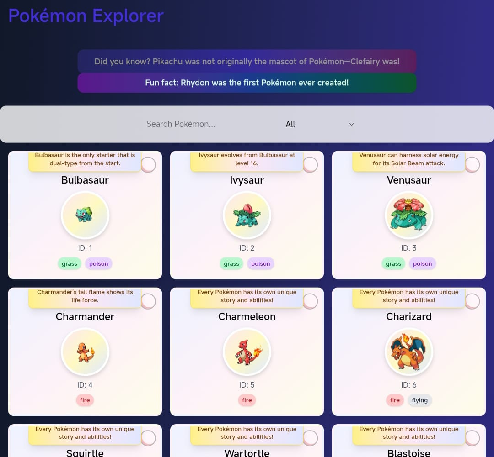
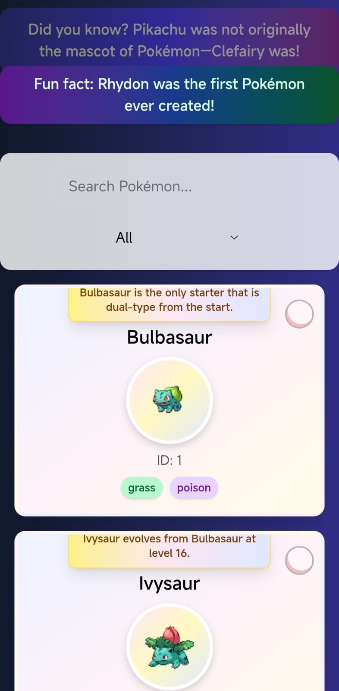

# 🌈✨ Pokémon Explorer ✨🌈

Welcome to **Pokémon Explorer** – a beautiful, interactive Pokédex built with  
**React**, **Tailwind CSS**, **DaisyUI**, and **Framer Motion**!  
Catch the magic of the first 150 Pokémon with smooth animations, pastel backgrounds, fun facts,  
and a delightful experience on both desktop and mobile! 🎉

---

## 🔗 Live Preview

🌐 **Try it now:** [pokemon-explorer-demo.vercel.app](https://pokemon-explorer-demo.vercel.app)  
*(Replace with your actual deployed link!)*

---

## 🌟 Features

- 🫧 **Animated Bubble Background:**  
  Subtle, colorful bubbles float across the page for a lively, modern look.

- 📱 **Responsive Design:**  
  Looks amazing on desktop and mobile devices.

- 🔍 **Search & Filter:**  
  Instantly search Pokémon by name and filter by type.

- 🧠 **Fun Pokémon Facts:**  
  Every card displays a unique or fallback fun fact about the Pokémon.

- 🃏 **Animated Cards:**  
  Cards and images gently animate to bring the Pokédex to life.

- 🔎 **Expandable Cards:**  
  Tap/click a card to view more details in a fullscreen modal, including height, weight, and types.

- 🎨 **Soft Gradients:**  
  Cards and backgrounds use soft, non-intrusive gradients for a modern, friendly feel.

---

## 🚀 Getting Started

1. **Clone the repository:**  
   ```bash
   git clone https://github.com/your-username/pokemon_app.git
   cd pokemon_app
   ```

2. **Install dependencies:**  
   ```bash
   npm install
   ```

3. **Run the app:**  
   ```bash
   npm run dev
   ```

4. **Open in your browser:**  
   [http://localhost:5173](http://localhost:5173)

---

## 🛠️ Tech Stack

- ⚛️ [React](https://react.dev/)
- 💨 [Tailwind CSS](https://tailwindcss.com/)
- 🌼 [DaisyUI](https://daisyui.com/)
- 🎞️ [Framer Motion](https://www.framer.com/motion/)
- 🎲 [PokéAPI](https://pokeapi.co/)

---

## 📸 Screenshots

| 🖥️ Desktop | 📱 Mobile |
|:----------:|:---------:|
|  |  |

---

## 🤝 Contributing

Contributions, issues and feature requests are welcome!  
Feel free to check the [issues page](https://github.com/riya1807pro/pokemon_app/issues).

---

## 🧑‍💻 Author

Made with ❤️ by Riya Kaushik

---

## ⭐️ Show your support

Give a ⭐️ if you like this project!

---

## 📜 License

This project is [MIT](LICENSE) licensed.

---

> Gotta catch 'em all! 🕹️✨